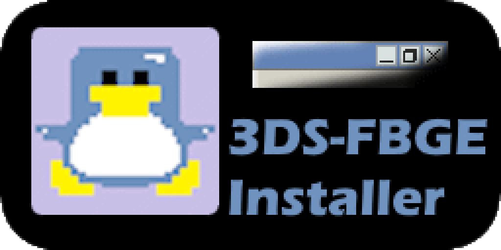
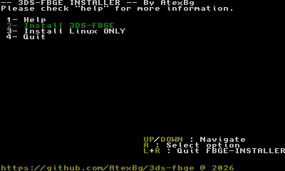
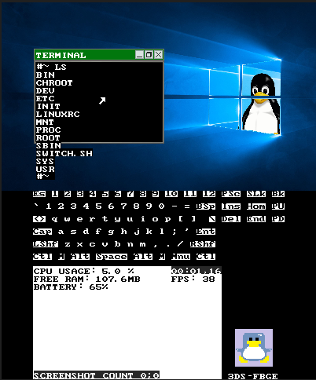

# FBGE-Installer
## An installer program for the [3ds-fbge](https://github.com/AtexBg/3ds-fbge) project.

## Usage :
Just run the app (either from the HOME menu with the .cia installed or from the Homebrew Launcher using the 3dsx file) and follow the instructions to install and run the thing.

If there's any problem, you can open an issue on the appropriate repo depending whether it's a problem with [the 3ds-fbge project](https://github.com/AtexBg/3ds-fbge/issues/new) or [the installer itself](https://github.com/AtexBg/fbge-installer/issues/new), or even contact me (atexbg) on Discord if you prefer to.

## Compiling : 
Just go to the project directory and run make. If you wanna make a CIA installable title run the `3dsx2cia.bat` script (**Windows only**) and the compiled 3DSX binary will be converted to `build/FBGE-INSTALLER.CIA`.

Thanks to [DevKitPro](https://devkitpro.org/wiki/Getting_Started) for the toolchain, [this GBATemp thread](https://gbatemp.net/threads/cxitool-convert-3dsx-to-cia-directly.440385/) for the tools to make the CIA file, the [libctru examples](https://github.com/devkitPro/3ds-examples) for the uses of some functions and the little bit of energy **i** had left to finish this software...

License GPLv3. By AtexBg. May 1 2026.